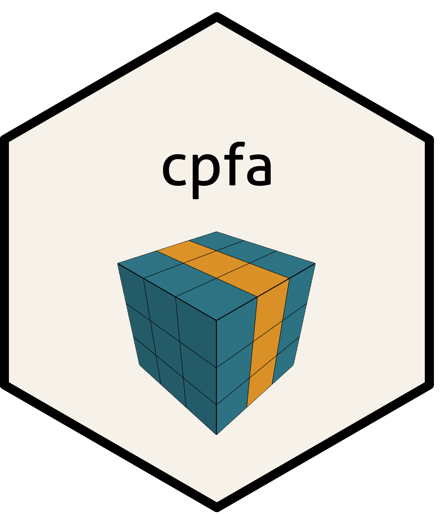

 

# *cpfa*: Classification with Parallel Factor Analysis 

Package **cpfa** implements a k-fold cross-validation procedure to predict class labels using component weights from a single mode of a Parallel Factor Analysis model-1 (Parafac; Harshman, 1970) or a Parallel Factor Analysis model-2 (Parafac2; Harshman, 1972), which is fit to a three-way or four-way data array. The package also supports principal component analysis (PCA) applied to a two-way data matrix. After fitting a Parafac or Parafac2 model with package **multiway** via an alternating least squares algorithm (Helwig, 2025), or after fitting a PCA model using the singular value decomposition, estimated component weights from one mode of the selected component model are passed to one or more classification methods. For each method, a k-fold cross-validation is conducted to tune classification parameters using estimated component weights, optimizing class label prediction. This process is repeated over multiple train-test splits in order to improve the generalizability of results. Multiple constraint options are available to impose on any mode of the Parafac or Parafac2 model during the estimation step (see Helwig, 2017). Multiple numbers of components can be considered in the primary package function `cpfa`. Additional features can be included alongside model-generated features to enhance classification.

# License

This package is free and open-source software. This package is licensed under [GPL (>= 3)](http://www.gnu.org/licenses/gpl-3.0.en.html).

# Bugs and Suggestions

I'm grateful for all bug reports. Please feel free to share bug reports through 'issues'. If you have suggestions for improvements or for new features, those are always welcome. I'll work on addressing your suggestions as quickly as I can.

# References

Harshman, R. (1970). Foundations of the PARAFAC procedure: Models and conditions for an explanatory multimodal factor analysis. UCLA Working Papers in Phonetics, 16, 1-84.

Harshman, R. (1972). PARAFAC2: Mathematical and technical notes. UCLA Working Papers in Phonetics, 22, 30-44.

Helwig, N. (2017). Estimating latent trends in multivariate longitudinal data via Parafac2 with functional and structural constraints. Biometrical Journal, 59(4), 783-803.

Helwig, N. (2025). multiway: Component Models for Multi-Way Data. R package version 1.0-7, <https://CRAN.R-project.org/package=multiway>.